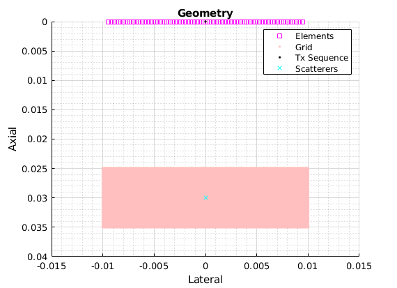
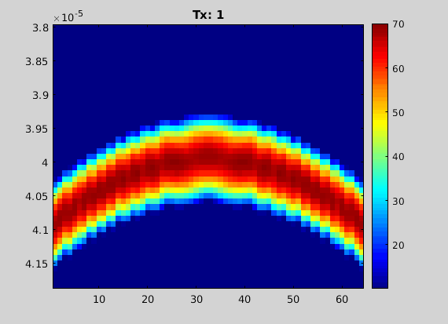
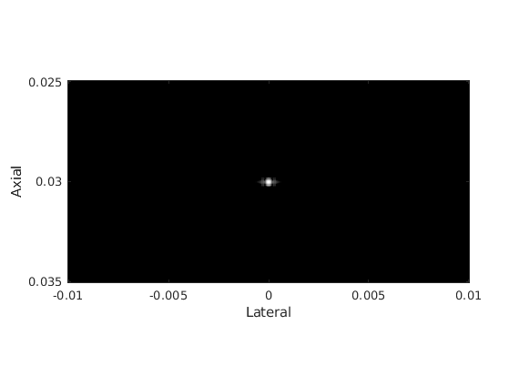

# QUPS: Quick Ultrasound Processing &amp; Simulation

[](https://www.mathworks.com/matlabcentral/fileexchange/161381-qups)


## Description
QUPS (pronounced "CUPS") is an abstract, lightweight, readable tool for prototyping pulse-echo ultrasound systems and algorithms. 
It provides a flexible, high-level representation of transducers, pulse sequences, imaging regions, and scattering media as well as hardware accelerated implementations of common signal processing functions for pulse-echo ultrasound systems.
QUPS can interface with multiple other Ultrasound acquisition, simulation and processing tools including [Verasonics](https://verasonics.com/vantage-advantage/), [k-Wave](http://www.k-wave.org/index.php), [MUST](https://www.biomecardio.com/MUST/), [FieldII](https://www.field-ii.dk/) and [USTB](https://www.ustb.no/).

This package can readily be used to develop new transducer array designs by specifying element positions and orientations or develop new pulse sequence designs by specifying waveforms, element delays, and element weights (apodization). Simulating the received echoes (channel data) is supported for any valid UltrasoundSystem. Define custom properties or overload the built-in classes to create new types.


## Features
- Flexible:
    - 3D space implementation
    - Transducers: Arbitrary transducer positions and orientations
    - Sequences: Arbitrary transmit waveform, delays, and apodization
    - Scans (Image Domain): Arbitrary pixel locations and beamforming apodization
    
- Performant:
    - Beamform a 1024 x 1024 image for 256 x 256 transmits/receives in < 2 seconds (RTX 3070)
    - Hardware acceleration via CUDA (Nvidia) or OpenCL (AMD, Apple, Intel, Nvidia), or natively via the [Parallel Computing Toolbox](https://www.mathworks.com/products/parallel-computing.html)
    - Memory efficient classes and methods minimize data storage and computional load
    - Batch simulations locally via [`parcluster`](https://www.mathworks.com/help/parallel-computing/parcluster.html) or scale to a cluster with the [MATLAB Parallel Server](https://www.mathworks.com/products/matlab-parallel-server.html) (optional) toolbox.

- Modular:
    - Transducer, pulse sequence, pulse waveform, scan region etc. each defined separately
    - Optionally [overload classes](src/README.md) to customize behaviour
    - Easily compare sequence to sequence or transducer to transducer
    - Simulate with [MUST](https://www.biomecardio.com/MUST/documentation.html), [FieldII](https://www.field-ii.dk/), or [k-Wave](http://www.k-wave.org/index.php) without redefining most parameters
    - Export or import data between [USTB](https://www.ustb.no/) or [Verasonics](https://verasonics.com/vantage-advantage/) data structures

- Intuitive:
    - Native MATLAB semantics with tab auto-completion
    - Overloaded `plot` and `imagesc` functions for data visualization
    - Documentation via `help` and `doc`


## Installation 
### MATLAB R2023b+ & git
Starting in MATLAB R2023b+, QUPS and most of it's extension packages can be installed within MATLAB via [buildtool](https://www.mathworks.com/help/matlab/ref/buildtool.html) if you have setup [git for MATLAB](https://www.mathworks.com/help/matlab/matlab_prog/set-up-git-source-control.html).
1. Install qups
```
gitclone("https://github.com/thorstone25/qups.git");
cd qups;
```
2. (optional) Install and patch [extension](##Extensions) packages and compile mex and CUDA binaries (failures can be safely ignored)
```
buildtool install patch compile -continueOnFailure
```
3. (optional) Run tests (~10 min)
```
buildtool test
```

### Legacy Installation
If the above procedure does not work for you, you can manually download and install each [extension](##Extensions).
1. Download the desired extension packages into a folder adjacent to the "qups" folder e.g. if qups is located at `/path/to/my/qups`, kWave should be downloaded to an adjacent folder `/path/to/my/kWave`.

2. Create a MATLAB [Project](https://www.mathworks.com/help/matlab/matlab_prog/create-projects.html) and add the root folder of the extension to the path e.g. `/path/to/my/kWave`.
* Note: The "prj" file in USTB is a [_Toolbox_](https://www.mathworks.com/help/matlab/matlab_prog/create-and-share-custom-matlab-toolboxes.html) file, not a [_Project_](https://www.mathworks.com/help/matlab/matlab_prog/) file - you will still need to make a new _Project_.

3. Open the `Qups.prj` project and add each extension package as a [reference](https://www.mathworks.com/help/matlab/matlab_prog/componentize-large-projects.html).

4. (optional) Apply [patches](###parallel-processing-with-external-packages) to enable further parallel processing.

5. (optional) Run tests via the `runProjectTests()` function in the build directory.
```
addpath build; runProjectTests('verbosity', 'Concise'),
```

## Extensions
All extensions to QUPS are optional, but must be installed separately from their respective sources.

| Extension | Description | Installation Paths | Citation |
| ------ | ------ | ------ | ---------- |
| [FieldII](https://www.field-ii.dk/)   | point scatterer simulator | `addpath path/to/fieldII`| [website](https://www.field-ii.dk/?background.html) |
| [k-Wave](http://www.k-wave.org/index.php) | distributed medium simulator | `addpath path/to/kWave` | [website](https://github.com/ucl-bug/k-wave?tab=readme-ov-file#license)  |
| [kWaveArray](http://www.k-wave.org/forum/topic/alpha-version-of-kwavearray-off-grid-sources) | k-Wave transducer extension | `addpath path/to/kWaveArray` | [forum](http://www.k-wave.org/forum/topic/alpha-version-of-kwavearray-off-grid-sources), [paper](http://bug.medphys.ucl.ac.uk/papers/2019-Wise-JASA.pdf) |
| [MUST](https://www.biomecardio.com/MUST/documentation.html)  | point scatterer simulator | `addpath path/to/MUST`| [website](https://www.biomecardio.com/MUST/documentation.html) |
| [USTB](www.ustb.no) | signal processing library and toolbox | `addpath path/to/USTB` | [website](https://www.ustb.no/citation/) |
| [Matlab-OpenCL](https://github.com/thorstone25/Matlab-OpenCL) | hardware acceleration | (see [README](https://github.com/thorstone25/Matlab-OpenCL/blob/main/README.md))| [website](https://github.com/IANW-Projects/MatCL?tab=readme-ov-file#reference) (via MatCL) |
| [CUDA](https://docs.nvidia.com/cuda/cuda-quick-start-guide/index.html) | hardware acceleration | (see [CUDA Support](#cuda-support)) | |

## Quick Start
1. Start MATLAB R2020b or later and open the [Project](https://www.mathworks.com/help/matlab/projects.html)
```
openProject .
```
2. (optional) Setup any available acceleration
```
setup parallel CUDA cache; % setup the environment with any available acceleration
```

3. Create an ultrasound system and point scatterer to simulate
```
scat = Scatterers('pos', 1e-3*[0 0 30]'); % a single point scatterer at 20mm depth
xdc = TransducerArray.L11_5v(); % simulate a Verasonics L11-5v transducer
seq = Sequence('type', 'FSA', 'numPulse', xdc.numel); % full synthetic-aperture pulse sequence
scan = ScanCartesian('x', 1e-3*[-10, 10], 'z', 1e-3*[25 35]); % set the image boundaries - we'll set the resolution later
us = UltrasoundSystem('xdc', xdc, 'seq', seq, 'scan', scan, 'fs', 4*xdc.fc); % create a system description
[us.scan.dx, us.scan.dz] = deal(us.lambda / 4); % set the imaging resolution based on the wavelength
```

4. Display the geometry
```
figure; plot(us); hold on; plot(scat, 'cx'); % plot the ultrasound system and the point scatterers
```



5. Simulate channel data
```
chd = greens(us, scat); % create channel data using a shifted Green's function (OpenCL-enabled)
% chd = calc_scat_multi(us, scat); %  ... or with FieldII
% chd = kspaceFirstOrder(us, scat); % ... or with k-Wave (CUDA-enabled)
% chd = simus(us, scat); %            ... or with MUST   (CUDA-enabled)

```
6. Display the channel data 
```
figure; imagesc(chd);
colormap jet; colorbar;
animate(chd.data);
```


7. Beamform
```
b = DAS(us, hilbert(chd));
```
8. Display the B-mode image
```
figure; imagesc(us.scan, b); % plot the image (in dB when b is complex)
dbr b-mode 60; % ... with 60dB dynamic range
title('B-mode image');
```



## Documentation
QUPS is documented within MATLAB. To see all the available classes, use `help ./src` or `doc ./src` from within the QUPS folder. Use `help` or `doc` on any class or method with `help classname` or `help classname.methodname` e.g. `help UltrasoundSystem.DAS`.

For a walk through of going from defining a simulation to a beamformed image, see [example.mlx](example.mlx) (or [example_.m](example_.m)).

See the [examples](examples/) folder for examples of specific applications.

For syntax examples for each class, see [cheat_sheet.m](cheat_sheet.m).

For further documentation on customizing classes, see the class structure [README](src/README.md).

If you have trouble, please submit an [issue](https://github.com/thorstone25/qups/issues).

## Citation
If you use this software, please cite this repository using the [citation file](CITATION.cff) or via the menu option in the "About" section of the [github page](github.com/thorstone25/qups).

If you use any of the extensions, please see their citation policies:
* [FieldII](https://www.field-ii.dk/?background.html)
* [MUST](https://www.biomecardio.com/MUST/documentation.html)
* [MatCL](https://github.com/IANW-Projects/MatCL?tab=readme-ov-file#reference) (via Matlab-OpenCL)
* [k-Wave](https://github.com/ucl-bug/k-wave?tab=readme-ov-file#license)
* [USTB](https://www.ustb.no/citation/)

## Parallel Processing with External Packages
Some QUPS methods, including most simulation and beamforming methods, can be parallelized natively by specifying a `parcluster` or launching a `parallel.ProcessPool` or a `parallel.ThreadPool`. However, restrictions apply. 

Workers in a `parallel.ThreadPool` cannot call mex functions, use GUIs or user inputs, or perform any file operations (reading or writing). Workers in a `parallel.ProcessPool` or `parcluster` do not have these restrictions, but tend to be somewhat slower and require much more memory. All workers are subject to [race conditions](https://en.wikipedia.org/wiki/Race_condition). 

Removing race conditions and inaccesible functions in the extension packages will enable native parallelization. The patches described below are applied automatically with the "patch" task via buildtool. Otherwise, you will need to apply the patches manually to enable parallelization.

### [FieldII](https://www.field-ii.dk/) 
FieldII uses [mex](https://www.mathworks.com/help/matlab/call-mex-file-functions.html) functions for all calls, which requires file I/O. This **cannot** be used with a `parallel.ThreadPool`, but can easily be used with a `parallel.ProcessPool` or `parcluster`.

###  [k-Wave](http://www.k-wave.org/index.php) (with binaries)
To enable simulating multiple transmits simultaneously using k-Wave binaries, the temporary filename race condition in `kspaceFirstOrder3DC.m` must be removed. 
Edit `kspaceFirstOrder3DC.m` and look for an expression setting the temporary folder `data_path = tempdir`. Replace this with `data_path = tempname; mkdir(data_path);` to create a new temporary directory for each worker. 
You may also want to delete this folder after the temporary files are deleted. Record a variable `new_path = true;` if a new directory was created, and place `if new_path, rmdir(data_path); end` at the end of the function. Otherwise, the temporary drive is cleared when the system reboots.

On Linux, the filesystem does not deallocate deleted temporary files until MATLAB is closed. This can lead to write erros if many large simulations are run in the same MATLAB session. To avoid this issue, within `kspaceFirstOrder3DC.m`, set the file size of the temporary input/output files to 0 bytes prior to deleting them, e.g.
```
if isunix % tolerate deferred deletion for parpools on linux
        system("truncate -s 0 " + input_filename );
        system("truncate -s 0 " + output_filename);
end
delete(input_filename );
delete(output_filename);
```

### [MUST](https://www.biomecardio.com/MUST/documentation.html)
To enable the usage of a `parallel.ThreadPool` with the `simus()` method, the GUI and file I/O calls used in the `AdMessage` and `MUSTStat` functions must not be called from `pfield.m` and/or `pfield3.m` (see [#2](https://github.com/thorstone25/qups/issues/2)). It is safe to comment out the advertising and statistics functions.

### [Matlab-OpenCL](github.com/thorstone25/Matlab-OpenCL)
OpenCL support is provided via [Matlab-OpenCL](github.com/thorstone25/Matlab-OpenCL), but is only tested on Linux. This package relies on [MatCL](https://github.com/IANW-Projects/MatCL), but the underlying OpenCL installation is platform and OS specific. The following packages and references may be helpful, but are not tested for compatability.

##### Ubuntu 22.04: 
| Command  | Description |
| ------- | ------------- |
| `sudo apt install opencl-headers`                    | Compilation header files (req'd for all devices)|
| `sudo apt install pocl-opencl-icd`                   | Most CPU devices |
| `sudo apt install intel-opencl-icd`                  | Intel Graphics devices |
| `sudo apt install nvidia-driver-xxx`                 | Nvidia Graphics devices (included with the driver) |
| `sudo apt install ./amdgpu-install_x.x.x-x_all.deb`  | AMD Discrete Graphics devices (see [here](https://docs.amd.com/projects/install-on-linux/en/latest/how-to/amdgpu-install.html) or [here](https://docs.amd.com/projects/install-on-linux/en/latest/how-to/native-install/ubuntu.html))|


### CUDA Support
Starting in R2023a, CUDA support is provided by default within MATLAB via [`mexcuda`](https://www.mathworks.com/help/parallel-computing/mexcuda.html).

Otherwise, for CUDA to work, `nvcc` must succesfully run from the MATLAB environment. If a Nvidia GPU is available and `setup CUDA cache` completes with no warnings, you're all set! If you have difficulty getting nvcc to work in MATLAB, you may need to figure out which environment paths are required for _your_ CUDA installation. Running `setup CUDA` will attempt to do this for you, but may fail if you have a custom installation.

#### Linux
First, be sure you can run `nvcc` from a terminal or command-line interface per [CUDA installation instructions](https://docs.nvidia.com/cuda/cuda-installation-guide-linux/index.html). Then set the `MW_NVCC_PATH` environmental variable within MATLAB by running `setenv('MW_NVCC_PATH', YOUR_NVCC_BIN_PATH);` prior to running `setup CUDA`. You can run `which nvcc` within a terminal to locate the installation directory. For example, if `which nvcc` returns `/opt/cuda/bin/nvcc`, then run `setenv('MW_NVCC_PATH', '/opt/cuda/bin');`.

#### Windows
First, setup your system for CUDA per [CUDA installation instructions](https://docs.nvidia.com/cuda/cuda-installation-guide-microsoft-windows/index.html). On Windows you must set the path for both CUDA and the _correct_ MSVC compiler for C/C++. Start a PowerShell terminal within Visual Studio. Run `echo %CUDA_PATH%` to find the base CUDA_PATH and run `echo %VCToolsInstallDir%` to find the MSVC path. Then, in MATLAB, set these paths with `setenv('MW_NVCC_PATH', YOUR_CUDA_BIN_PATH); setenv('VCToolsInstallDir', YOUR_MSVC_PATH);`, where `YOUR_CUDA_BIN_PATH` is the path to the `bin` folder in the `CUDA_PATH` folder. Finally, run `setup CUDA`. From here the proper paths should be added.

